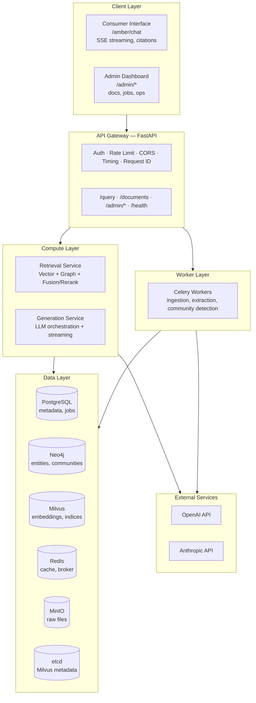

# Amber 


> **Preserving Context, Revealing Insight**

Amber answers questions over a document collection by combining vector search with a knowledge graph built from those same documents. It ingests your files, extracts entities and relationships into Neo4j, embeds the chunks into Milvus, and picks a retrieval strategy per query. Every answer comes back with citations to the chunks it was built from.

[](https://opensource.org/licenses/MIT)
[](https://github.com/yuzushi-dev/Amber/releases)

## Overview

A plain RAG system retrieves chunks by vector similarity alone. That works until the answer depends on how things in the corpus relate to each other, and then it quietly returns the wrong five chunks. Amber builds that structure explicitly instead of hoping the embeddings encode it.

At ingestion, each document is chunked, embedded into Milvus, passed to an LLM that extracts entities and relationships into Neo4j, and the resulting entity graph is clustered into communities with the hierarchical Leiden algorithm. At query time, any of those layers can be searched, and usually more than one is.

Five retrieval modes:

- **Basic**: vector-only search, for simple queries
- **Local**: entity-focused graph traversal, for precise lookups
- **Global**: map-reduce over community summaries, for broad questions
- **Drift**: iterative reasoning with generated follow-up questions, for complex queries
- **Structured**: direct Cypher execution, for list and count queries

## Getting Started

### Prerequisites

- **Docker & Docker Compose v2.20+** - Recommended for easiest setup
- **LLM Provider** - At least one required:
  - [OpenAI](https://platform.openai.com/) - GPT models (cloud)
  - [Anthropic](https://console.anthropic.com/) - Claude models (cloud)
  - [Ollama](https://ollama.com/) - Local models, no API key needed
- **System Resources** - Minimum:
  - 8 GB RAM (16 GB recommended)
  - 20 GB disk space
  - 2 CPU cores (4+ recommended)

### Quick Start (Docker - Recommended)

1. **Clone the Repository**
   ```bash
   git clone https://github.com/yuzushi-dev/Amber.git
   cd Amber
   ```

2. **Configure Environment**
   ```bash
   cp .env.example .env
   ```

   Edit `.env` and set at least your LLM API key and `SECRET_KEY` (generate with `openssl rand -hex 32`) — see the file's inline comments for the full option list.

3. **Launch Services**
   ```bash
   # Standard launch (CPU mode)
   ./start.sh
   
   # With NVIDIA GPU support (for local embeddings/models)
   ./start.sh --gpu
   
   # Or manually:
   # docker compose up -d
   # docker compose -f docker-compose.yml -f docker-compose.gpu.yml up -d  # GPU
   ```

   This starts 11 services:
   - `nginx` - Edge proxy, owns all external traffic (host `:8000` for the API, host `:80` for the frontend)
   - `api` - FastAPI backend (internal; exposed through nginx)
   - `frontend` - React frontend (internal; served through nginx)
   - `worker` - Celery workers
   - `celery_beat` - Scheduler for periodic tasks
   - `postgres` - Metadata database (host port 5433 → container 5432)
   - `neo4j` - Graph database (ports 7474, 7687)
   - `milvus` - Vector database (ports 19530, 9091)
   - `etcd` - Milvus metadata store (internal)
   - `redis` - Cache & broker (port 6379)
   - `minio` - S3-compatible object storage; console on port 9001, S3 API on 9000 inside the network only

   > **Note:** nginx owns host ports `:8000` and `:80`. The API and frontend containers do not bind host ports directly. For a zero-downtime deploy, `deploy/docker-compose.canary.yml` brings up an `api-canary` container on port 8001, which you can smoke-test without nginx in the path; `deploy/cutover.sh --to canary` then repoints nginx at it, `--dry-run` shows the change first, and `--to live` rolls back.

4. **Run Database Migrations** (Critical!)
   ```bash
   make migrate
   # or: docker compose exec api alembic upgrade head
   ```

5. **Access the Application**
   - **Frontend**: [http://localhost](http://localhost) (served by nginx on port 80; the frontend container runs `npm run dev` automatically)
   - **API Docs**: [http://localhost:8000/docs](http://localhost:8000/docs)
   - **Neo4j Browser**: [http://localhost:7474](http://localhost:7474)
     - Username: `neo4j`
     - Password: (from `.env` `NEO4J_PASSWORD`)
   - **MinIO Console**: [http://localhost:9001](http://localhost:9001)
     - Credentials: (from `.env` `OBJECT_STORAGE_ACCESS_KEY` / `OBJECT_STORAGE_SECRET_KEY`)

6. **Verify Health**
   ```bash
   curl http://localhost:8000/health
   # Should return: {"status": "healthy"}
   ```

7. **Generate an API Key**
   ```bash
   make generate-key
   # or: docker compose exec api python -c "from src.shared.security import generate_api_key; print(generate_api_key())"
   ```

   Save the generated key - you'll need it for API requests.

### First Steps

1. **Upload Your First Document** (via API)
   ```bash
   curl -X POST "http://localhost:8000/v1/documents" \
     -H "X-API-Key: your-api-key-here" \
     -F "file=@path/to/document.pdf"
   ```

2. **Check Processing Status**
   ```bash
   curl "http://localhost:8000/v1/documents/{document_id}/status" \
     -H "X-API-Key: your-api-key-here"
   ```

3. **Query the Knowledge Base**
   ```bash
   curl -X POST "http://localhost:8000/v1/query" \
     -H "X-API-Key: your-api-key-here" \
     -H "Content-Type: application/json" \
     -d '{
       "query": "What are the main topics in my documents?",
       "options": {
         "search_mode": "basic",
         "include_sources": true
       }
     }'
   ```

   Stream instead with `GET/POST /v1/query/stream` (SSE). See `/docs` for the full API reference.

## Key Features

### Retrieval

Every mode below is reachable per query, either by naming it explicitly or by letting the router pick one.

- **Vector & Hybrid Search (Basic)**: Dense (`nomic-embed-text`, 768-dim by default) + sparse SPLADE vectors, fused in Milvus with Reciprocal Rank Fusion; Redis result caching.
- **Graph-Enhanced Retrieval**: Local (entity-focused traversal), Global (hierarchical community summaries), Drift (agentic iterative exploration).
- **Query Processing**: Rewriting, decomposition, HyDE, automatic routing, structured (Cypher) query detection.
- **Document Taxonomy & Audience Routing**: Documents are auto-classified (`AdminGuide`, `CEGuide`, `UserGuide`, `ZendeskKB`); a deterministic `ProductContextResolver` maps query terminology to edition/audience with no LLM call, pre-filtering the candidate pool with a 4-stage broadening fallback to guarantee recall.

### Knowledge Graph

Entities and relations are extracted per chunk, deduplicated, then clustered into communities that can be summarized and searched on their own. LLM-powered extraction with gleaning (iterative re-extraction) maximizes recall; hierarchical Leiden clustering builds the community layer; incremental updates avoid full rebuilds. See [ARCHITECTURE.md](ARCHITECTURE.md) for the extraction and clustering internals.

**Shared GraphRAG & Document ACL**: a `default` tenant acts as the enterprise knowledge base, with other tenants consuming shared content via explicit ACL grants; vector, graph, and global search all filter by document-share visibility, cached in Redis with invalidation on share mutations, and independently kill-switchable at runtime.

### Document Processing

Everything between an uploaded file and a queryable chunk runs in Celery, with document state tracked in Postgres so a crashed worker does not lose the job.

- **Formats**: PDF (Docling, Kreuzberg, or PyMuPDF4LLM, with Unstructured as general fallback), Markdown, plain text, Confluence/Zendesk connectors.
- **Chunking**: Semantic, structure-respecting, token-aware overlap.
- **Background Processing**: Async Celery tasks, state machine, automatic retries with backoff, stale-job recovery.
- **Deduplication**: Content-hash (SHA-256) based, idempotent ingestion.

### Generation & Quality

Generation is provider-agnostic, streams over SSE, and attaches per-chunk citations plus a quality score to every answer.

- **Providers**: OpenAI, Anthropic, Ollama (local), Ollama Cloud (sequential API-key failover); tiered by role (extraction / RAG / evaluation).
- **Complexity Routing**: A deterministic, no-LLM scorer rates each query across 9 dimensions and assigns a tier (`simple`/`standard`/`complex`/`reasoning`) that selects the Ollama model, opt-in per tenant.
- **Citations & Grounding**: Chunk-level citations with relevance scores, source dedup, interactive citation explorer.
- **Quality Guardrails**: Faithfulness and relevance checks, follow-up suggestions, Ragas evaluation integration.
- **User Feedback**: Thumbs up/down, admin review queue, Q&A library, golden dataset export.

### Admin & Operations

The admin UI covers documents, connectors, jobs, backups, evaluation, and live tuning of retrieval parameters — see `/admin/data`, `/admin/connectors`, `/admin/ops`, and `/admin/backup`. Full system backup covers Postgres, Neo4j, Milvus, and MinIO, with point-in-time restore (`scripts/backup.sh`, `--dry-run` supported).

### Security & Reliability

Multi-tenancy is enforced at the database layer, not only in application code, and guards fail closed when Redis is missing.

- **AuthN/AuthZ**: SHA-256 hashed API keys, tiered scopes (`user`/`tenant_admin`/`super_admin`); tenant comes from the key's links, `FORCE ROW LEVEL SECURITY` on tenant tables via a non-superuser Postgres role.
- **Secrets**: Zero-downtime `SECRET_KEY` rotation, Fernet-encrypted connector credentials, one-time-use SSE auth tickets, sanitized exception responses.
- **Resilience**: Circuit breakers, graceful degradation, exponential-backoff retries, fail-closed LLM capacity guard.
- **Observability**: Request tracing, per-stage timing, cache hit rates, per-query cost/latency/error metrics, audit trail with real caller identity.

## System Architecture

Amber runs as a set of services behind an nginx edge proxy: a React frontend, a FastAPI API, Celery workers for everything slow, and six data stores that each hold one kind of state (Postgres, Neo4j, Milvus, Redis, MinIO, etcd).



### Technology Stack

| Layer          | Component        | Technology                | Purpose                                   |
| -------------- | ---------------- | ------------------------- | ----------------------------------------- |
| **Frontend**   | UI Framework     | React 19 + Vite           | Modern reactive UI with fast HMR          |
|                | Router           | TanStack Router v1        | Type-safe routing                         |
|                | State            | Zustand + TanStack Query  | Global state & server state management    |
|                | Styling          | Tailwind CSS + shadcn/ui  | Utility-first CSS with components         |
|                | UI Components    | Radix UI + Framer Motion  | Accessible components with animations     |
|                | Graph Viz        | React Force Graph 2D/3D   | Interactive knowledge graph visualization |
| **API**        | Framework        | FastAPI 0.133+            | High-performance async API                |
|                | Runtime          | Python 3.11+              | Modern Python with type hints             |
|                | Server           | Uvicorn                   | ASGI server with hot reload               |
|                | Validation       | Pydantic v2               | Data validation and serialization         |
| **Databases**  | Metadata         | PostgreSQL 16             | ACID-compliant relational data            |
|                | Graph            | Neo4j 5 Community         | Property graph with Cypher queries        |
|                | Vector           | Milvus 2.5+               | Hybrid search (Dense + Sparse)            |
|                | Cache            | Redis 7                   | In-memory cache & message broker          |
|                | Object Storage   | MinIO                     | S3-compatible file storage                |
|                | Coordination     | etcd                      | Milvus metadata store (internal)          |
| **Processing** | Task Queue       | Celery 5.3+               | Distributed async task processing         |
|                | Broker           | Redis                     | Task queue backend                        |
|                | Migrations       | Alembic                   | Database schema versioning                |
| **External**   | LLM Providers    | OpenAI, Anthropic         | Text generation & embeddings              |
|                | Extraction       | Unstructured, PyMuPDF4LLM | Multi-format document parsing             |
|                | Reranking        | FlashRank                 | Fast semantic reranking                   |
|                | Graph Clustering | igraph + leidenalg        | Community detection                       |
|                | Evaluation       | Ragas                     | RAG metrics evaluation                    |
| **Infra**      | Orchestration    | Docker Compose            | Service orchestration                     |

For extraction internals, retrieval fusion math, and the agentic ReAct loop, see [ARCHITECTURE.md](ARCHITECTURE.md).

## API Reference

Full OpenAPI specification at `/docs`. Key endpoints:

### Core Endpoints

| Method     | Endpoint                    | Description                   |
| ---------- | --------------------------- | ----------------------------- |
| `POST`     | `/v1/query`                 | Submit a RAG query            |
| `GET/POST` | `/v1/query/stream`          | Stream query response via SSE |
| `GET`      | `/v1/chat/history`          | List conversations owned by the authenticated API key |
| `GET`      | `/v1/chat/history/{conversation_id}` | Read one conversation owned by the authenticated API key |
| `DELETE`   | `/v1/chat/history/{conversation_id}` | Delete one conversation owned by the authenticated API key |
| `POST`     | `/v1/documents`             | Upload a document             |
| `GET`      | `/v1/documents/{id}`        | Get document details          |
| `GET`      | `/v1/documents/{id}/status` | Check processing status       |

Conversation history is scoped to the authenticated API key; see [ARCHITECTURE.md](ARCHITECTURE.md#conversation-ownership) for ownership and export endpoint details.

### Admin & Connector Endpoints

| Method | Endpoint                                   | Description                 |
| ------ | ------------------------------------------ | ---------------------------- |
| `GET`  | `/v1/admin/jobs`                           | List background jobs        |
| `POST` | `/v1/admin/jobs/{id}/cancel`               | Cancel a job                 |
| `POST` | `/v1/admin/maintenance/communities/detect` | Trigger community detection  |
| `POST` | `/v1/admin/ragas/benchmark/run`            | Run evaluation               |
| `GET`  | `/v1/connectors`                           | List available connector types |
| `POST` | `/v1/connectors/{type}/sync`               | Trigger sync (full or incremental) |
| `POST` | `/v1/connectors/{type}/ingest`             | Ingest selected items by ID   |

## Development & Testing

```bash
make test          # Run all tests
make test-unit     # Unit tests only
make test-int      # Integration tests
make coverage      # With coverage report
make format        # Format code
make lint          # Run linter
make typecheck     # Type checking
make migrate-new   # Create a migration
make migrate       # Run migrations
```

See [CONTRIBUTING.md](CONTRIBUTING.md) for running without Docker, the production build, and troubleshooting.

## Contributing

Contributions are welcome — see [CONTRIBUTING.md](CONTRIBUTING.md).

## License

Amber is released under the **MIT License**. See [LICENSE](LICENSE) for details. Release history is in [CHANGELOG.md](CHANGELOG.md).
