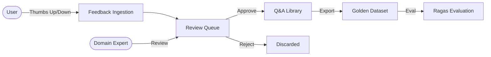

# Feedback System & Quality Assurance

<!-- markdownlint-disable MD013 -->

## Overview

Amber includes a comprehensive **Feedback Loop** designed to continuously
improve system accuracy through human-in-the-loop (HITL) validation.

## Architecture



## 1. User Feedback

Users can rate any AI response in the chat interface:

- **Thumbs Up**: "This answer is accurate and helpful."
- **Thumbs Down**: "This answer is incorrect, hallucinated, or incomplete."

When a rating is submitted, the system captures:

- The `request_id` plus any client-provided metadata (query/answer, selected
  snippets, session ID).
- The user sentiment (positive/negative) and optional comment.

> **Note:** Query/answer text is only stored if the client includes it in the
> `metadata` payload.

## 2. Review Queue (`/admin/metrics/feedback`)

The Admin Dashboard provides a dedicated interface for reviewing user feedback.

### Workflow

1. **Inbox**: All user ratings appear in the "Pending" tab.
2. **Analysis**: The Admin sees the user's query, the AI's answer, and any
   captured metadata (e.g., selected snippets).
3. **Action**:
   - **Verify**: Confirm the AI was correct. Moves to "VERIFIED" status.
   - **Reject**: Mark feedback as invalid or not useful. Moves to "REJECTED"
     status.

API endpoints:

- `GET /v1/admin/feedback/pending`
- `POST /v1/admin/feedback/{feedback_id}/verify`
- `POST /v1/admin/feedback/{feedback_id}/reject`

## 3. Q&A Library

The **Q&A Library** acts as the long-term memory of "known good" interactions.
It serves two critical purposes:

### Golden Dataset Generation

Verified Q&A pairs are the gold standard for evaluation. You can export this
dataset to:

- Run automated benchmarks (Ragas) to measure system drift.
- Test new prompts or retrieval parameters against proven questions.

### Fine-Tuning Roadmap

In future versions, this library will be used to Direct Preference Optimization
(DPO) training for local models, teaching them the specific tone and domain
knowledge of your organization.

API Endpoints:

- `GET /v1/admin/feedback/approved`
- `PUT /v1/admin/feedback/{feedback_id}/toggle-active`
- `DELETE /v1/admin/feedback/{feedback_id}`

## 4. Golden Dataset Export

Admins can export the verified Q&A pairs as JSONL via
`GET /v1/admin/feedback/export`.

The export includes feedback metadata. If the client provided `query` and
`answer` in feedback metadata, those fields will be included.

```json
{
  "id": "fb_123",
  "request_id": "req_456",
  "score": 1.0,
  "comment": "Accurate and helpful",
  "metadata": {
    "query": "How do I reset my password?",
    "answer": "Go to Settings > Profile > Security and click 'Reset Password'.",
    "session_id": "conv_789"
  }
}
```
