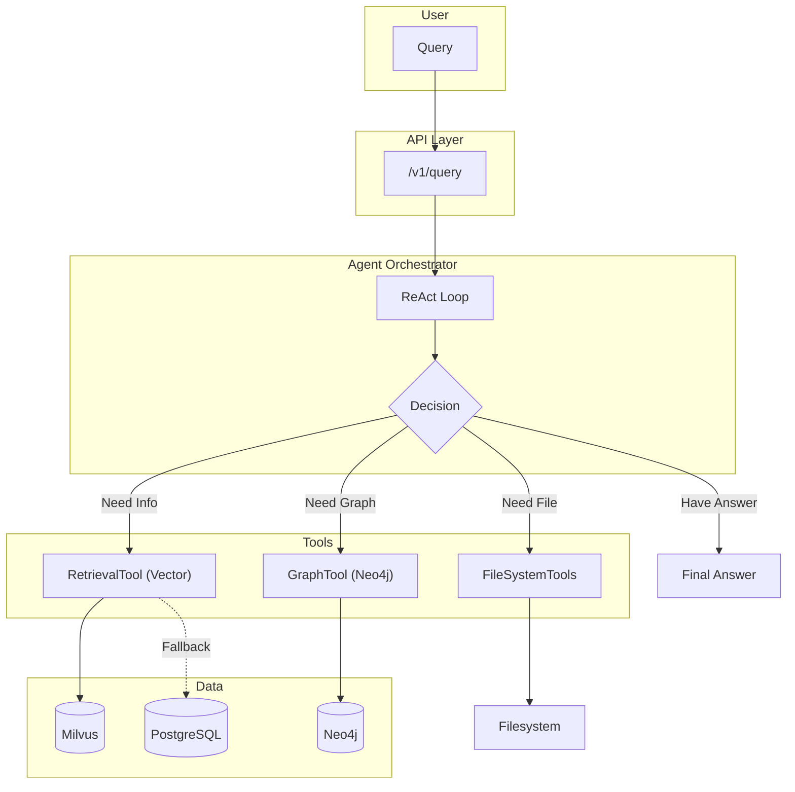

# Agentic Retrieval

<!-- markdownlint-disable MD013 -->

## Overview

This document is a full implementation walkthrough of the **Agentic RAG** system
implemented in Amber. Unlike traditional "retrieve-then-generate" pipelines,
the Agentic RAG employs a **ReAct (Reason+Act) loop**, enabling the LLM to
iteratively call tools, evaluate results, and refine its strategy until it
finds a satisfactory answer.

## Architecture Overview



## Core Components

### Agent Orchestrator

**File**: [src/core/agent/orchestrator.py](../src/core/agent/orchestrator.py)

The brain of the system. Implements the ReAct loop:

| Step | Action                                          |
| ---- | ----------------------------------------------- |
| 1    | Receive user query                              |
| 2    | LLM decides: call tool OR give final answer     |
| 3    | If tool: execute tool, append result to context |
| 4    | Repeat until final answer or max steps          |

**Key Features:**

- **Max Steps Guard**: Prevents infinite loops (default: 10).
- **Trace Recording**: Each tool call is logged for debugging.
- **Flexible Tool Loading**: Tools are injected at runtime.

### Retrieval Tool

**File**: [src/core/tools/retrieval.py](../src/core/tools/retrieval.py)

Wraps the `RetrievalService` for agent use. Converts natural language intent
into vector search.

```python
async def search_codebase(query: str) -> str:
    result = await service.retrieve(query=query, tenant_id=tenant_id, top_k=5)
    # Format results for LLM consumption
    return formatted_output
```

**Robustness**: Handles both Pydantic objects and dicts for compatibility.

### Graph Tool

**File**: [src/core/tools/graph.py](../src/core/tools/graph.py)

Allows the agent to query the Neo4j Knowledge Graph directly using Cypher.

```python
async def query_graph(cypher_query: str) -> str:
    result = await neo4j_client.execute_read(cypher_query)
    return json.dumps(result)
```

**Use Case**: Finding relationships between entities (e.g., "Which functions
call `IngestionService.process_document`?").

### FileSystem Tools

**File**: [src/core/tools/filesystem.py](../src/core/tools/filesystem.py)

Provides raw filesystem access for the "Maintainer Agent" mode.

| Tool             | Description                  |
| ---------------- | ---------------------------- |
| `read_file`      | Read file contents           |
| `list_directory` | List directory contents      |
| `grep_search`    | Search for patterns in files |

> **Caution:** Filesystem tools are **disabled by default** and only available
> in "Maintainer Agent" mode.

## Agent Modes

The system supports two distinct operational modes, controlled via the
`agent_role` parameter in the API request.

### Knowledge Agent (Default)

- **Role**: `knowledge`
- **Tools**: `RetrievalTool`, `GraphTool`
- **Use Case**: Safe Q&A over ingested documents and code. No filesystem access.
- **Security**: Cannot read arbitrary files or execute code.

### Maintainer Agent

- **Role**: `maintainer`
- **Tools**: `RetrievalTool`, `FileSystemTools`
- **Use Case**: Deep code exploration, debugging, and maintenance tasks.
- **Security**: Requires explicit opt-in via API parameter.

**API Usage:**

```json
{
  "options": {
    "agent_mode": true,
    "agent_role": "maintainer"
  }
}
```

### Local LLM Configuration (Ollama)

To use the agent with a local model (e.g., Llama 3):

#### Configure Environment

```ini
OLLAMA_BASE_URL=http://localhost:11434/v1
OLLAMA_MODEL=llama3
```

#### Run Agent

The system will automatically detect the configuration and use the local model
for both reasoning (ReAct loop) and tool execution. Note that smaller models
(<70B) may have reduced reasoning capabilities compared to GPT-4o.

## Resilient Content Fallback

### Problem

During testing, the Milvus Vector Store sometimes returned empty `content`
strings in search results, causing the agent to fail to answer questions
despite the data existing in the system.

### Solution

The `RetrievalService` now implements a **Resilient Fallback**:

1. After vector search, check if any result has empty content.
2. If so, fetch the missing content from PostgreSQL (`Chunk` table).
3. Enrich the results before returning to the agent.

**File**: [src/core/services/retrieval.py](../src/core/services/retrieval.py#L576)

### Observability

The fallback is tracked via:

- **Log**: `METRIC: Resilient Content Fallback Triggered for {count} chunks`
- **OTel Event**: `resilient_fallback_triggered` with `chunk_count` attribute.
- **Span Attribute**: `retrieval.fallback_count`.

## Verification Results

### Test Case: Carbonio User Guide

**Query**: *"How do I set the default calendar view in Carbonio?"*

**Agent Execution:**

1. **Thought**: Search for calendar settings.
2. **Action**: `search_codebase(query="default calendar view Carbonio")`
3. **Observation**: Retrieved Chunk 132 with step-by-step instructions.
4. **Final Answer**:
   > 1. Click Settings (gear icon).
   > 2. Select Calendars.
   > 3. Click Default view.
   > 4. Select desired view.
   > 5. Click SAVE.

**Resilience Test**: The initial vector search returned empty content. The
fallback mechanism automatically fetched content from PostgreSQL, and the agent
answered correctly without any awareness of the recovery.

## References

| Component         | File                                                                |
| ----------------- | ------------------------------------------------------------------- |
| Orchestrator      | [src/core/agent/orchestrator.py](../src/core/agent/orchestrator.py) |
| System Prompts    | [src/core/agent/prompts.py](../src/core/agent/prompts.py)           |
| Retrieval Tool    | [src/core/tools/retrieval.py](../src/core/tools/retrieval.py)       |
| Graph Tool        | [src/core/tools/graph.py](../src/core/tools/graph.py)               |
| FileSystem Tools  | [src/core/tools/filesystem.py](../src/core/tools/filesystem.py)     |
| Retrieval Service | [src/core/services/retrieval.py](../src/core/services/retrieval.py) |
| Query API         | [src/api/routes/query.py](../src/api/routes/query.py)               |
| Query Schema      | [src/api/schemas/query.py](../src/api/schemas/query.py)             |

## Summary

The Agentic RAG implementation transforms Amber from a passive search engine
into an **intelligent investigator**. It can:

- Decompose complex queries.
- Iteratively search multiple data sources.
- Self-correct when initial results are insufficient.
- Recover gracefully from data retrieval failures.

The system is ready for production use with robust observability and security
controls.
