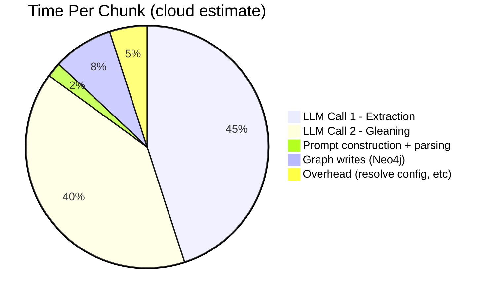
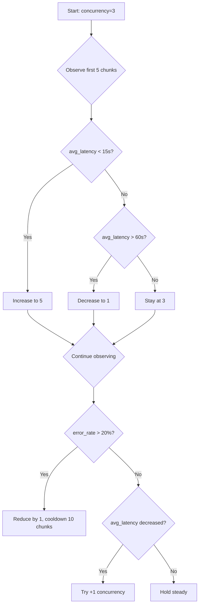

# Graph Sync Performance Optimization Plan

## 1. Baseline Profile (from real worker logs)

The data below comes from observing document `doc_9dd39a9214454531` (55 chunks) being processed on cloud-hosted Ollama (`devstral-small-2:24b` at `172.25.85.78:11434`).

### Cloud Ollama (Strong Server)

| Metric | Value |
|--------|-------|
| Chunks observed | 30 / 55 |
| Total wall-clock | 31.6 min |
| Throughput | **0.95 chunks/min** |
| Avg interval between completions | 65.4s |
| Median interval | 51.6s |
| P95 interval | 157.0s |
| Max interval (worst chunk) | 185.6s |
| LLM calls (extraction + gleaning) | 60 (2 per chunk) |
| Effective LLM calls/min | 1.90 |
| Effective seconds per LLM call | **31.6s** |

#### Parallelism Evidence

The `Semaphore(5)` in [processor.py](file:///root/amber2/src/core/graph/application/processor.py) does provide *partial* benefit on cloud Ollama. Out of 30 chunks, 18 completed in 7 burst groups (2–4 chunks completing within 30s of each other), while 12 were isolated, serial completions. This suggests:

- Cloud Ollama can handle 2–3 concurrent inference requests (not 5)
- The semaphore overprovisioning (5 slots) leads to request queuing inside Ollama
- The burst groups correspond to moments when multiple in-flight requests return close together

### Local Ollama (Weak Machine) — Estimated

No direct logs from a local run, but based on Ollama's architecture:

| Metric | Expected Value | Rationale |
|--------|---------------|-----------|
| Effective parallelism | **1** | Single GPU, serial inference |
| Seconds per LLM call | **60–120s** | Weak hardware + same model |
| Throughput | **~0.25–0.5 chunks/min** | 2 serial LLM calls per chunk |
| 55-chunk document | **2–4 hours** | — |

> [!IMPORTANT]
> On local Ollama, the `Semaphore(5)` is **pure overhead**: 5 requests queue at the HTTP layer, Ollama processes them one at a time, and the only effect is wasted memory holding 5 pending HTTP connections.

### Where Time Goes (per chunk)

Analysis of the code path [graph_extractor.py:49-277](file:///root/amber2/src/core/ingestion/infrastructure/extraction/graph_extractor.py#L49-L277):



- **~85% of time is LLM inference** (extraction + gleaning)
- **~8% is Neo4j writes** — each chunk triggers 1 entity write + N relationship writes (one per relationship type), each a separate `execute_write` call creating a new session
- **~7% is overhead** — config resolution, metric tracking, parse

---

## 2. Intervention Evaluation (Ranked by Expected Impact)

### Intervention 1: Extraction Cache (Hash-Based LLM Dedup)

**Impact: ★★★★★ | Complexity: Medium | Helps: Both**

Currently, **zero caching** exists in the extraction path. If a document is re-processed (e.g., after a failed `graph_sync` that left partial results), all chunks re-hit the LLM from scratch.

#### What to Change

| File | Change |
|------|--------|
| [NEW] [extraction_cache.py](file:///root/amber2/src/core/ingestion/infrastructure/extraction/extraction_cache.py) | Redis-backed cache keyed by `sha256(chunk_content + prompt_version + model_id)` |
| [graph_extractor.py](file:///root/amber2/src/core/ingestion/infrastructure/extraction/graph_extractor.py) | Check cache before calling `provider.generate()`, store result after |
| [processor.py](file:///root/amber2/src/core/graph/application/processor.py) | Pass `cache_enabled` flag from config |

**Cache key:**
```python
key = hashlib.sha256(
    f"{chunk_content}|{prompt_version}|{model}|{temperature}|{seed}".encode()
).hexdigest()
```

**Expected improvement:**
- Re-ingestion of same document: **100% LLM call savings** (cache hit)
- First ingestion: 0% improvement
- Risk: Cache invalidation when prompt changes → mitigated by including `prompt_version` in key

**Local vs Cloud:**
- Both benefit equally on re-runs
- No downside on either backend

---

### Intervention 2: Smart Gleaning (Conditional Second Pass)

**Impact: ★★★★☆ | Complexity: Low | Helps: Both**

Currently, [graph_extractor.py:169](file:///root/amber2/src/core/ingestion/infrastructure/extraction/graph_extractor.py#L169) *always* fires the gleaning pass if `use_gleaning=True` (which is the default—confirmed at [tasks.py:412](file:///root/amber2/src/workers/tasks.py#L412) and [composition_root.py:153](file:///root/amber2/src/amber_platform/composition_root.py#L153)).

The gleaning prompt ([entity_extraction.py:98-119](file:///root/amber2/src/core/generation/application/prompts/entity_extraction.py#L98-L119)) includes the *entire* extraction prompt + Pass 1 output + a new instruction, making it the **most token-heavy call** in the pipeline.

#### What to Change

**Option A: Coverage signal in Pass 1 (Recommended)**

Modify the extraction prompt to include a self-assessed coverage line at the end:

```
**After extraction, rate your coverage (0.0–1.0) on the last line:**
COVERAGE: 0.X
```

Then in `graph_extractor.py`, parse a `COVERAGE:` line. Only trigger gleaning if `coverage < threshold` (suggest 0.8).

| File | Change |
|------|--------|
| [entity_extraction.py](file:///root/amber2/src/core/generation/application/prompts/entity_extraction.py) | Add coverage signal instruction to `get_tuple_extraction_prompt` |
| [graph_extractor.py](file:///root/amber2/src/core/ingestion/infrastructure/extraction/graph_extractor.py) | Parse coverage signal, conditionally skip gleaning |

**Expected improvement:**
- In practice, most well-structured chunks yield high coverage on Pass 1. Estimated 60–80% of chunks will skip gleaning → **30–40% reduction in LLM calls**
- On a 55-chunk document: from 110 LLM calls → ~70–80
- Wall-clock: from ~32 min → ~20–22 min on cloud

**Option B: Per-section gleaning (Move gleaning out of per-chunk loop)**

Instead of gleaning per chunk, collect all entities from Pass 1 across the full document, then run a single gleaning pass per document asking "what did the extraction miss?"

| Pros | Cons |
|------|------|
| Only 1 gleaning call per doc instead of N | Requires holding all Pass 1 results in memory before writing |
| Better quality: sees cross-chunk context | More complex refactor of `process_chunks` flow |
| Bigger win on large docs | Gleaning prompt would be very long for 50+ chunk docs |

> [!WARNING]
> Per-section gleaning has diminishing returns: the gleaning prompt for a 55-chunk doc would need to include 500+ entity names, making the prompt itself expensive. **Option A is more practical.**

**Local vs Cloud:**
- Local benefits more (fewer serial LLM calls = proportionally bigger time savings)
- Cloud benefits too, but parallelism partially masks it

---

### Intervention 3: Adaptive Concurrency Governor

**Impact: ★★★★☆ | Complexity: Medium-High | Helps: Both**

The current `Semaphore(5)` is static. On local Ollama, it wastes resources; on cloud, it might still be suboptimal.

#### What to Change

| File | Change |
|------|--------|
| [NEW] [concurrency_governor.py](file:///root/amber2/src/core/graph/application/concurrency_governor.py) | Adaptive semaphore that adjusts based on observed latency/error rate |
| [processor.py](file:///root/amber2/src/core/graph/application/processor.py) | Replace static `Semaphore(5)` with governor |
| [settings.yaml](file:///root/amber2/config/settings.yaml) | Add `graph_sync` section with profile presets |

**Governor Design:**

```python
class ConcurrencyGovernor:
    """Adjusts in-flight LLM calls based on observed throughput."""
    
    def __init__(self, initial_limit: int = 3, min_limit: int = 1, max_limit: int = 10):
        self._sem = asyncio.Semaphore(initial_limit)
        self._current_limit = initial_limit
        self._latencies: deque[float] = deque(maxlen=20)  # rolling window
        self._errors: deque[bool] = deque(maxlen=20)
    
    async def acquire(self):
        await self._sem.acquire()
    
    def release(self, latency_ms: float, had_error: bool):
        self._latencies.append(latency_ms)
        self._errors.append(had_error)
        self._sem.release()
        self._maybe_adjust()
    
    def _maybe_adjust(self):
        if len(self._latencies) < 5:
            return
        
        error_rate = sum(self._errors) / len(self._errors)
        avg_latency = sum(self._latencies) / len(self._latencies)
        
        # Scale down on errors or very high latency
        if error_rate > 0.2 or avg_latency > 60_000:
            new_limit = max(self._min_limit, self._current_limit - 1)
        # Scale up if things are fast and no errors
        elif error_rate == 0 and avg_latency < 15_000 and self._current_limit < self._max_limit:
            new_limit = self._current_limit + 1
        else:
            return  # No change
        
        if new_limit != self._current_limit:
            self._resize(new_limit)
```

**Key behaviors:**
- **Local Ollama:** After ~5 calls, observes high latency + serial behavior → converges to `limit=1`
- **Cloud Ollama (current):** Likely converges to `limit=2–3` based on actual throughput
- **Cloud Ollama (strong multi-GPU):** Could rise to `limit=5–10` if latency stays low

**Safe semaphore resizing:** We can't resize `asyncio.Semaphore` directly. Instead, the governor creates a new semaphore and drains the old one. In practice, the simplest approach is a token bucket (counter + condition variable) rather than `asyncio.Semaphore`.

**Oscillation prevention:** Use a cooldown (adjust no more than once every 10 completions) + hysteresis (require 3 consecutive signals in the same direction before adjusting).

**Local vs Cloud:**
- Local: Converges to single-flight, eliminating wasted queuing
- Cloud: Auto-tunes to optimal parallelism, no manual guessing

---

### Intervention 4: Batched Graph Writes

**Impact: ★★★☆☆ | Complexity: Low | Helps: Both (but minor)**

Currently in [writer.py](file:///root/amber2/src/core/graph/application/writer.py), each chunk triggers:
1. One `execute_write` for Document + Chunk + Entities MERGE ([line 86](file:///root/amber2/src/core/graph/application/writer.py#L86))
2. One `execute_write` per relationship type ([lines 103-119](file:///root/amber2/src/core/graph/application/writer.py#L103-L119))
3. One `execute_write` for community staleness ([line 138](file:///root/amber2/src/core/graph/application/writer.py#L138))

For a chunk with 5 relationship types, that's **7 separate Neo4j sessions**.

Each `execute_write` in [neo4j_client.py:97-119](file:///root/amber2/src/core/graph/infrastructure/neo4j_client.py#L97-L119) creates a new session (`async with driver.session()`) and runs a transaction.

#### What to Change

| File | Change |
|------|--------|
| [writer.py](file:///root/amber2/src/core/graph/application/writer.py) | Combine entity + relationship writes into a single Cypher query using APOC or chained `WITH` clauses |
| [writer.py](file:///root/amber2/src/core/graph/application/writer.py) | Add optional batch mode: accumulate N chunks of results, write in one transaction |
| [neo4j_client.py](file:///root/amber2/src/core/graph/infrastructure/neo4j_client.py) | Add `execute_write_batch(queries)` for multi-statement transactions |

**Expected improvement:**
- Per-chunk: reduce 5–7 Neo4j round-trips to 1–2
- Based on ~8% of wall-clock time being writes, this saves ~5% overall
- More impactful when Neo4j is remote or under load

> [!NOTE]
> Graph writes are NOT the bottleneck (they're ~8% of time). This is a "nice to have" improvement that reduces Neo4j connection churn but won't dramatically change throughput.

**Local vs Cloud:**
- Both: marginal improvement
- More impactful if Neo4j is on a separate host

---

### Intervention 5: Pipeline Stage Decoupling (Prepare → LLM → Write)

**Impact: ★★★☆☆ | Complexity: High | Helps: Both (marginal)**

Currently, [processor.py](file:///root/amber2/src/core/graph/application/processor.py) ties extraction and writing into the same async task (`_process_one`). The semaphore wraps **both** the LLM call and the graph write.

You asked about separating into separate Celery queues for `prepare`, `llm`, and `write`. After analysis:

#### Assessment

| Approach | Verdict |
|----------|---------|
| Separate Celery queues for stages | ❌ **Not worth it** |
| Decouple within asyncio (separate write buffer) | ✅ Worth considering |

**Why separate Celery queues don't help:**
1. The overhead of Celery task dispatch (serialize → Redis → deserialize) per chunk (~10ms) is negligible compared to the LLM call (~30s)
2. It adds operational complexity (3 queues, 3 worker types, retry logic between stages)
3. The "prepare" stage (prompt construction + config resolution) is ~100ms — not worth decoupling
4. The "write" stage is ~500ms — small enough to overlap without queues

**What DOES help:** Moving the `graph_write` call *outside* the semaphore so it doesn't block an LLM slot:

```python
# Current (writer holds semaphore slot):
async with sem:
    result = await extractor.extract(...)
    await self.writer.write_extraction_result(...)  # holds sem while writing!

# Better (release semaphore before writing):
async with sem:
    result = await extractor.extract(...)
results_queue.put(result)

# Separate coroutine drains results_queue and writes
```

This is a small refactor within `processor.py` and frees the semaphore slot ~500ms sooner per chunk.

---

### Intervention NOT Recommended: Multi-Endpoint Routing

You asked about routing between remote and local Ollama based on difficulty or health. After analysis:

**Assessment: ❌ Premature complexity**

Reasons:
1. The current system processes one model at a time from `tenant_config`. Routing per-chunk to different models would produce inconsistent entity taxonomies
2. Quality differences between local and cloud models affect entity extraction significantly — mixing models within one document would produce mismatched entity names and types
3. Failover at the provider level already exists in [factory.py](file:///root/amber2/src/core/generation/infrastructure/providers/factory.py) (the `with_failover` parameter)
4. If you want remote-preferred-with-local-fallback, that's a provider-level config, not a per-chunk routing decision

---

## 3. Ranked Interventions Summary

| Rank | Intervention | Expected Speedup | Complexity | Local | Cloud | Both |
|------|-------------|-------------------|------------|-------|-------|------|
| 1 | **Extraction Cache** | ∞ on re-runs | Medium | ✅ | ✅ | ✅ |
| 2 | **Smart Gleaning** | 30–40% on first run | Low | ✅✅ | ✅ | ✅ |
| 3 | **Adaptive Governor** | Correct-sizes concurrency | Medium | ✅✅ | ✅ | ✅ |
| 4 | **Batched Graph Writes** | ~5% | Low | ✅ | ✅ | ✅ |
| 5 | **Decouple Write from Semaphore** | ~5% | Low | ◻️ | ✅ | ✅ |

---

## 4. Implementation Plan

### Phase 1: Instrumentation (prerequisite for everything)

Add per-stage timing to `process_chunks` and `extract` so we can measure before/after:

| File | Change |
|------|--------|
| [MODIFY] [processor.py](file:///root/amber2/src/core/graph/application/processor.py) | Add `time.perf_counter()` around extract, write, and total; log as structured JSON |
| [MODIFY] [graph_extractor.py](file:///root/amber2/src/core/ingestion/infrastructure/extraction/graph_extractor.py) | Log LLM call latency, tokens, and whether gleaning ran |

**Logged metrics per chunk:**
```json
{
  "chunk_id": "...",
  "extraction_ms": 28500,
  "gleaning_ms": 26000,
  "gleaning_skipped": false,
  "write_ms": 450,
  "entities": 24,
  "relationships": 18,
  "tokens_total": 3200,
  "cache_hit": false
}
```

**Logged metrics per document:**
```json
{
  "document_id": "...",
  "total_chunks": 55,
  "total_ms": 1920000,
  "avg_chunk_ms": 34909,
  "p95_chunk_ms": 65000,
  "chunks_per_minute": 0.95,
  "llm_calls": 60,
  "cache_hits": 0,
  "gleaning_skipped": 0,
  "concurrent_limit_final": 5
}
```

### Phase 2: Extraction Cache

Feature flag: `GRAPH_SYNC_CACHE_ENABLED=true` (env var, default `true`)

1. Create `extraction_cache.py` with Redis backend
2. Modify `graph_extractor.py` to check/populate cache
3. Cache TTL: 7 days (configurable)

### Phase 3: Smart Gleaning

Feature flag: `GRAPH_SYNC_SMART_GLEANING=true` (default `true`)

1. Add `COVERAGE:` instruction to extraction prompt
2. Parse coverage in `graph_extractor.py`
3. Skip gleaning when coverage ≥ 0.8
4. Log whether gleaning was skipped for each chunk

### Phase 4: Adaptive Governor

Feature flag: `GRAPH_SYNC_ADAPTIVE_CONCURRENCY=true` (default `true`)

1. Create `concurrency_governor.py`
2. Replace static semaphore in `processor.py`
3. Log final concurrency limit per document

### Phase 5: Batched Graph Writes + Decouple

Feature flag: none (always safe to apply)

1. Refactor `writer.py` to combine entity + relationship writes
2. Move `write_extraction_result` outside the semaphore in `processor.py`

---

## 5. Profile Presets

### settings.yaml additions

```yaml
graph_sync:
  # Profile presets
  profile: "adaptive"  # Options: local_weak, cloud_strong, adaptive
  
  profiles:
    local_weak:
      initial_concurrency: 1
      max_concurrency: 2
      smart_gleaning: true
      gleaning_threshold: 0.7   # More aggressive skip
      cache_enabled: true
      cache_ttl_hours: 168      # 7 days
      
    cloud_strong:
      initial_concurrency: 5
      max_concurrency: 10
      smart_gleaning: true
      gleaning_threshold: 0.85  # Less aggressive skip (quality matters)
      cache_enabled: true
      cache_ttl_hours: 168
      
    adaptive:
      initial_concurrency: 3    # Start moderate
      max_concurrency: 10
      adaptive_concurrency: true
      smart_gleaning: true
      gleaning_threshold: 0.8
      cache_enabled: true
      cache_ttl_hours: 168
```

### Adaptive Mode Behavior



---

## 6. Verification Plan

### Automated Tests

```bash
# Unit tests for extraction cache
pytest tests/unit/graph/test_extraction_cache.py -v

# Unit tests for concurrency governor
pytest tests/unit/graph/test_concurrency_governor.py -v

# Unit tests for smart gleaning
pytest tests/unit/extraction/test_smart_gleaning.py -v

# Integration test: process a small document and verify metrics are logged
pytest tests/integration/test_graph_sync_instrumented.py -v
```

### Manual Verification

1. **Before/After Benchmark:** Process the same 55-chunk document with:
   - Current code (baseline)
   - After each intervention
   - Compare chunk throughput, total time, and LLM call count

2. **Cache Verification:** Re-process the same document → expect 0 LLM calls, near-instant graph_sync

3. **Adaptive Governor Verification:**
   - Test with local Ollama → expect convergence to concurrency=1
   - Test with cloud Ollama → expect convergence to concurrency=2–3

4. **Profile Switching:** Set `profile: local_weak` → verify concurrency starts at 1 and smart gleaning is aggressive

### Metrics Dashboard

After instrumentation, run:
```bash
# Extract per-chunk metrics from worker logs  
docker compose logs worker | grep "graph_sync_metrics" | jq .
```

---

## Disagrees / Corrections

> [!IMPORTANT]
> **Your interpretation that local Ollama is "the hard bottleneck" is correct but incomplete.** The data shows that even on cloud Ollama with a 24B model, the effective throughput is only 0.95 chunks/min. The LLM inference time (~30s per call) is the bottleneck on BOTH backends, not just local. The difference is that cloud can achieve ~2-3x parallelism while local is strictly serial.

> [!NOTE]
> **Your suggestion to "decouple pipeline parallelism from LLM parallelism" via separate Celery queues is not worth the complexity.** The prepare stage (<100ms) and write stage (~500ms) are negligible compared to the LLM call (~30,000ms). Adding queue topology for stages that take 0.3% of wall-clock time creates operational overhead with no meaningful speedup. The *correct* decoupling is simply moving the write call outside the semaphore (5 lines of code change in `processor.py`).
